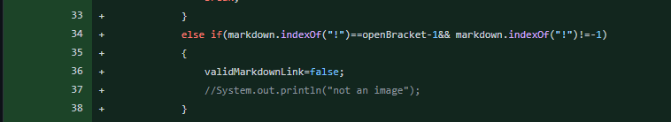
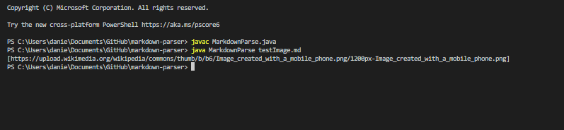
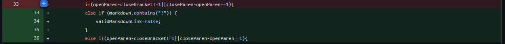
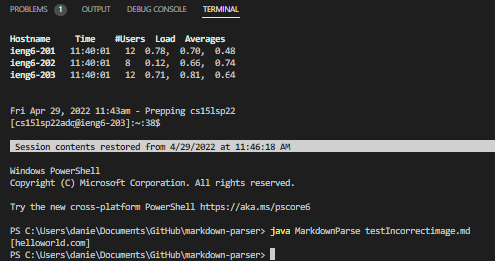
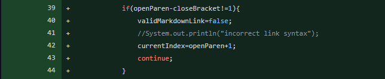
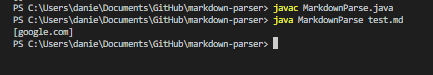

# Changes to MarkdownParse # 
## First Adjustment ## 

[Failed test File](testImage.html)

The failure inducing input is the markdown for a single image.

Since, the structure of the markdown is so similar, the old program incorrectly recognized the image as one of the URL. 

The reason this occured is because the only parameters originally used to consider it as a valid URL was the position of the brackets and because image markdown uses the same sequence of brackets, it was being incorrectly recognized as a URL. 

## Second Adjustment ##

[Failed test File](testNoLink.html)

The failure inducing input was the image markdown except it was preceded with multiple exclamation marks

Since the markdownparser originally used indexOf to find the index of the exclamation marker and compared it with the location of the brackets, it would fail to see the exclamation mark for an image if there were exclamation marks before it. Therefore, it incorrectly puts the image URL path as a link URL in the Arraylist. 

## Third Adjustment ##

[Failed test File](test.html)

The failure inducing input was a typical link markdown except there were a bunch of spaces in between the last closing bracket and the first opening parantheses. This shouldn't be recognized as a link, but with the original code, it was. 

This was because our code was instructed to return the substring inbetween the two parantheses regardless of the placement of the brackets relative to the parantheses. 