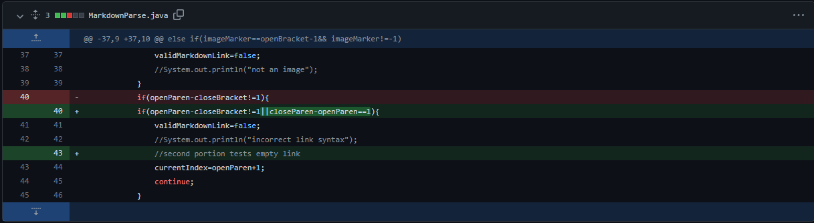
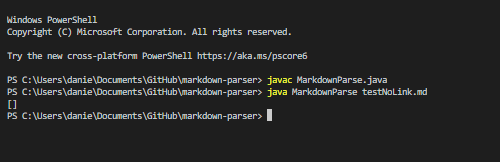
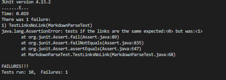

# Changes to MarkdownParse # 
## First Adjustment ## 

[Failed test File](testImage.html)

The failure inducing input is the markdown for a single image.

Since, the structure of the markdown is so similar, the old program incorrectly recognized the image as one of the URL. 

The reason this occured is because the only parameters originally used to consider it as a valid URL was the position of the brackets and because image markdown uses the same sequence of brackets, it was being incorrectly recognized as a URL. 

## Second Adjustment ##

[Failed test File](testNoLink.html)

The failure inducing input was the typical markdown for a URL except there wasn't a URL

Since there was nothing checking the contents inside of the parantheses, this empty string was considered a URL and added to the ArrayList. From the initial test using javac, it was impossible to tell, but from testing the arraylist size using JUnit, it was showing that unexpected output

## Third Adjustment ##

[Failed test File](test.html)

The failure inducing input was a typical link markdown except there were a bunch of spaces in between the last closing bracket and the first opening parantheses. This shouldn't be recognized as a link, but with the original code, it was. 

This was because our code was instructed to return the substring inbetween the two parantheses regardless of the placement of the brackets relative to the parantheses. 