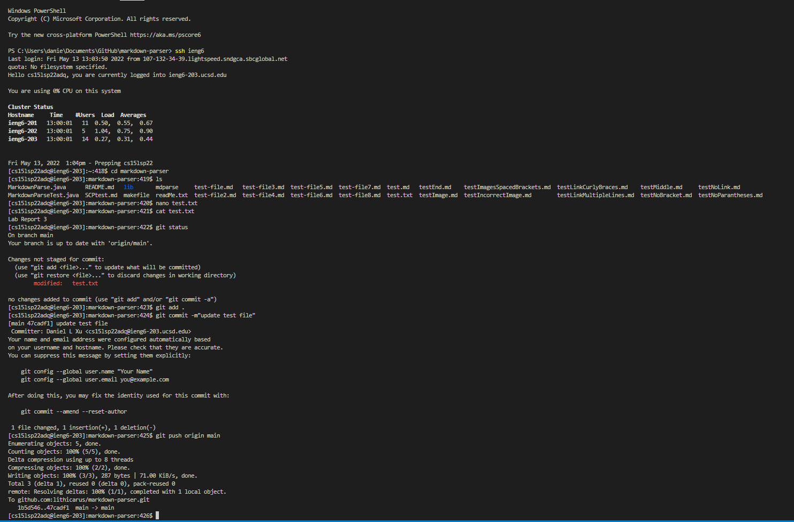

# Lab Report 3 #

## Option 1 ##

config was created and edited using notepad

Here, I copied Markdownparser.java into the ieng6. Then I ssh into ieng6 and ls 
to display and confirm that the Markdownparser copy was made. 

## Option 2 ##

Option 2 required to make an access token using the ssh server. This involved generating a key using `ssh-keygen` on the ieng6 server and adding that public keys contents to Githubs keys. Below is the public githubKey

After making the keys, both public and private keys were stored in a file called .ssh on my ieng6 server. Below is both those private and public keys with the private being called githubKey and the public key called githubKey.pub

I simply edited a text file called test.txt using nano and then cat to make sure the edit happened. I then added the edit to the stage, committed it, and then pushed it to the origin. 

below is the link for these changes on the github repo

[Github Changes Link](https://github.com/lithicarus/markdown-parser/commit/47cadf1daaf3ea325e3a2290f9c6be27f1b2a864)

## Option 3 ##

Option 3 has us copy files into our ieng6 server recursively using the command 

`scp -r . cs15lsp22@ieng6.ucsd.edu:~/markdown-parse`

This will copy all the files into a new directory named markdown-parse. Below are the images of this running as well as the running of the Markdown files in the ieng 6 server

You can conveniently do this in one line as well. Since I'm using windows, I had to delete all the class files and change the conventional javac and java lines. Below is it running on one line. 

