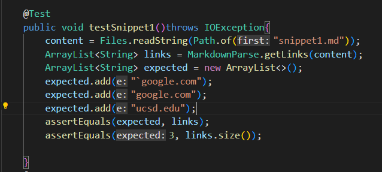
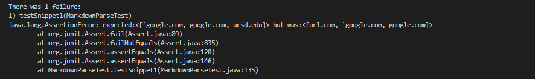
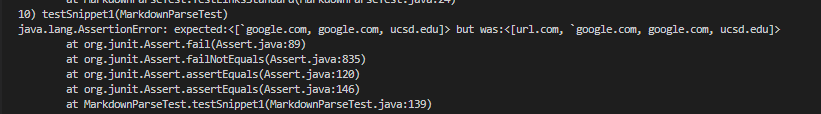
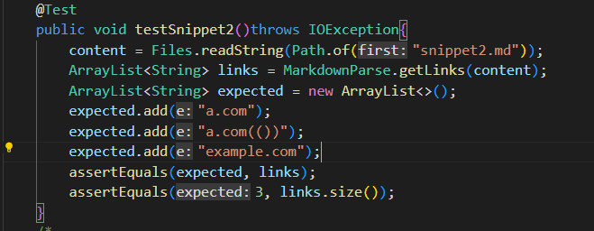
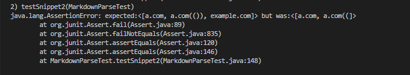
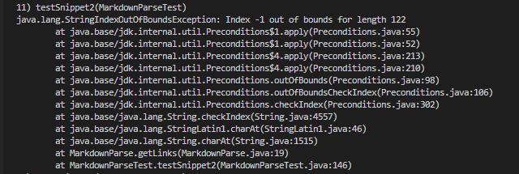
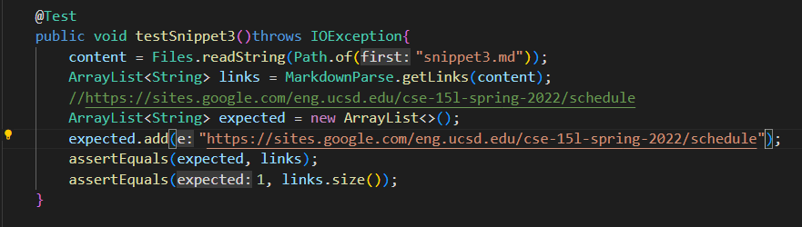
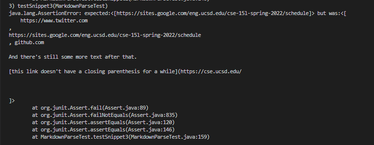
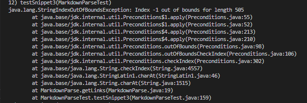

# Lab Report 4 #

## Snippet 1 ##

Snippet 1 should produce the links, google.com,google.com, and ucsd.edu

Below is the test written for Snippet 1. It creates an arraylist of the expected links based on what is seen in the preview. It then compares this list to the list produced by getLinks. To ensure there is no additional links, the size is checked as 3 as well. 

When running this on JUnit, we can see it gives a failure as expected. It displays both arraylists and it is evident that there is a failure. 

For the other repos code, 

For backline ticks, I don't think their is a simple line of code because we would need to track the relative location of the brackets to the backticks. While we could make this snippet work by checking specfiic locations of backticks like right before the first bracket, it wouldn't work if it was farther away. It can be argued you can use indexOf to check for backticks before, but then you have to consider the location of the other pair and if it actually disrupts the link syntax. 

## Snippet 2 ##

Snippet 2 should produce the links: a.com, a.com(()), example.com

The test written for snippet 2 is the same structure as snippet 1

When running this on JUnit, we can see it gives a failure as expected. It displays both arraylists and it is evident that there is a failure. 

For the other repos code, 

For multiple brackets and parantheses, there probably isn't an easy fix for the current code base as the way it detects links is to compare the indices of the bracket and parantheses elements relative to each other. To even figure out which bracket is the correct bracket and if there is a matching bracket, there isn't a simple solution. The most direct way to do this would be to somehow count the number of brackets and index them so that you could later retrieve them to create the substring, but that wouldn't be a short line of code. 

## Snippet 3 ##

Snippet 3 should produce the links: https://sites.google.com/eng.ucsd.edu/cse-15l-spring-2022/schedule

The test written for snippet 3 is the same structure as snippet 1

When running this on JUnit, we can see it gives a failure as expected. It displays both arraylists and it is evident that there is a failure. 

For the other repos code, 

This appears to be a simple fix. Instead of looking through the original markdown file, you can process it by removing all the new lines. One way is to use the replaceAll method which can remove all isntances of new lines. 