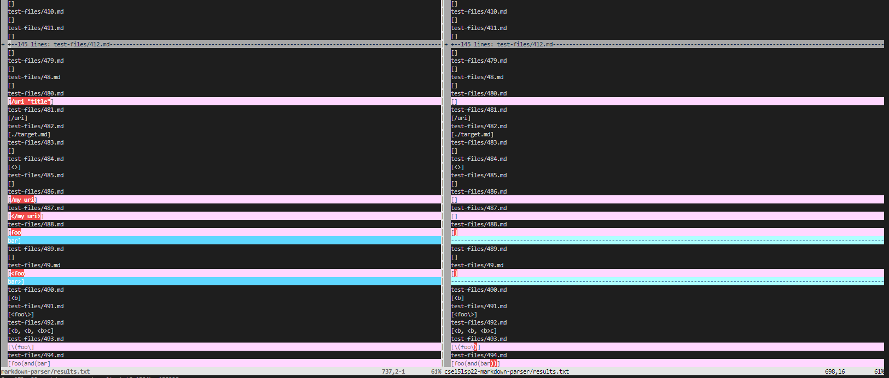
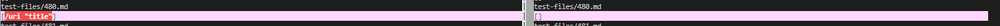
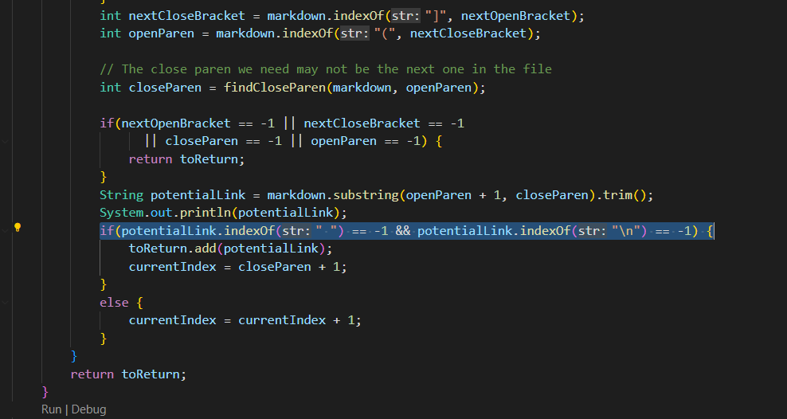
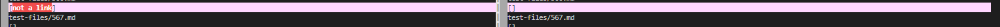

# Lab Report 5 #

This lab was performed by comparing the two markdownparser files: our own and the provided one by the instructors. After running the script.sh that ran many tests on both parsers and sending that data to a file called results.txt, it was then vimdiffed. 

At this point, our screen looked like this

After looking through the tests, it was noted that test 481 had different output 

The markdown for 481.md is 

` [link](/uri "title") ` 

based on markdown preview, the expected output is /uri "title" which our implementation got correct and the provided didn't. 

Looking at the provided markdownparser,the code fails at this highlighted point 

The problem is that although the markdownparser finds the potential link, it then scans if there is any spaces in the link. If there is a space in the link, it is not added to the arraylist. In 481, the space is in the link but it still functions and thus, the markdownparser incorrectly doesn't add it. The easiest fix is to simply remove that line section 

` potentialLink.indexOf(" ")== -1`

The second different result was 

the markdown for test 567 is 

`[foo](not a link) 
 [foo]: /url`

 Based on markdown preview, the expected output is []. This makes our markdownparser incorrect and the provided one correct. 

 The problem is that this test uses a definition list. In other words, [foo] is being substittued by /url. After substituting it in, it is no longer valid markdown for a link. Our implementation of the markdownparser didn't even create a check for this case so to fix this, you could add it anywhere before the addition to the arraylist. One fix idea is to scan the markdown for the substring of "[ and :" while checking that ] comes right before the :. If it exists, you can then replace the [] section with the substring right after the colon. Then you can run the parser on the modified markdown. 