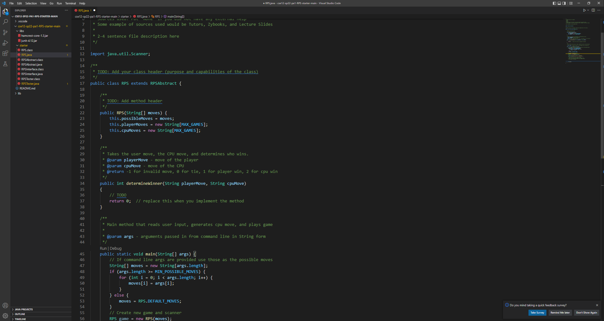
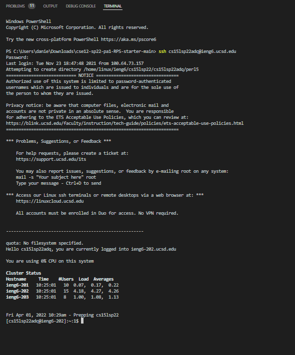
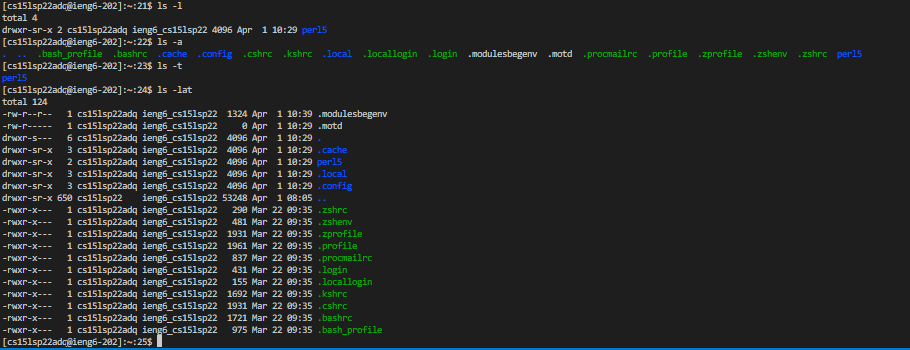
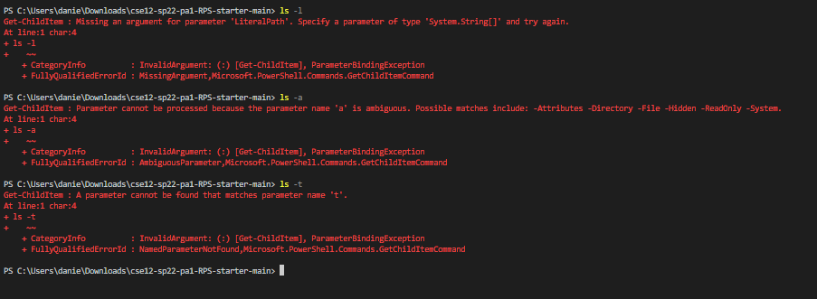
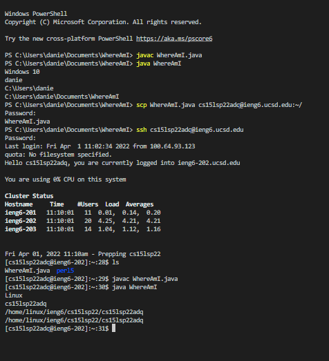
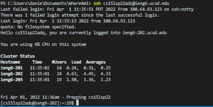

# Lab Report 1 #


## Downloading VSCode ##
---

simply google install vsCode. Install the correct type depending on what operating system you use. For this tutorial, we will show windows. Once you press download, you will download an installer. Once installed, you can create a new folder and open that project or you can open an existing project. Below is what it looks like if you open an existing project. 



## Remotely Connecting ##

Since this is on windows, you have to install openSSH first. If you are not on windows, this step is not necessary. 

[installing SSH](https://docs.microsoft.com/en-us/windows-server/administration/openssh/openssh_install_firstuse)

[You will then have to change your UCSD password for you ieng account](https://sdacs.ucsd.edu/~icc/index.php)

notice that your SSH user for ieng will be in the format 
cs15lsp22zz@ieng6.ucsd.edu

For the zz portion, it will be different for each person. For example, my user is cs15lsp22adq@ieng6.ucsd.edu

To connect, use the SSH bash command in your terminal and you will be prompted for a password. Type in your password and it should look like the image below. 



**CONGRATULATIONS!!!** 
you are now connected to the ieng6 computers

## Run Some Commands ##

Now to run some commands, you should try some common commands such as -cat which reads the contexts of the file. -ls which lists the files in that directory. cd ~ which changes the directory to the home directory. To see directory changes you can use the command pwd which prints the working directory. Below are some commands that I have tried



note that some of the typical bash commands don't always work for certain operating systems(Windows) so try them out.



To go back to your server, press CTRL-D or simply open a new terminal in VSCode

## Moving Files with scp ##
 
 Now we want to move files from your computer to the ieng6 server. To do this we have to use the scp command. In the terminal type -scp yourfile.java cs15lsp22adq@ieng6.ucsd.edu:~/

 You will be prompted to log in again. To ensure that this works, try running the file on this server using javac, java.


Notice how in the javafile whereAmI, the user information has changed depending on the server that the file ran on. This can be used to confirm successful scp. 

## Setting a SSH Key ## 

Since this process is a huge hassle, creating a key can bypass the process of logging in each time you want to copy a file onto the ieng6 saerver. 

Use the bash command -ssh keygen -t ed25519 and put no passphrase went prompted

This will create a public and a private key. Then you need to copy the public key to the .ssh directory 

1. run the ssh command 
2. run mkdir.ssh 
3. then run <br>
scp /Users/user-name/.ssh/id_rsa.pub cs15lsp22zz@ieng6.ucsd.edu:~/.ssh/authorized_keys which should match the path from the ssh command 

If successful, you can exit the server, attempt the scp command, and you should be able to run it without a password



## Optimizing Remote Running ##

To make copying and running files on the server even faster, you can use the following commands
```
scp WhereAmI.java cs15lsp22adq@ieng6.ucsd.edu:~/
ssh cs15lsp22adq@ieng6.ucsd.edu
javac WhereAmI.java; java WhereAmI
```
After the first run, you can use up arrow keys to further eliminate the amount of keystrokes required while using different file names. 
